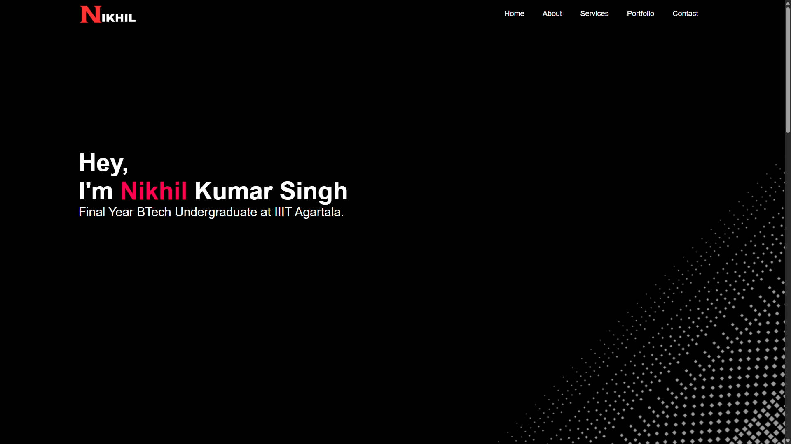
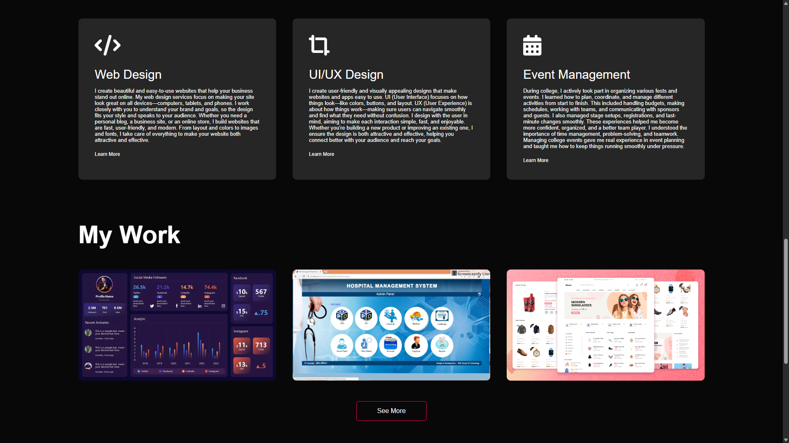

# 🌐 Nikhil Kumar Singh – Personal Portfolio Website

Welcome to my personal portfolio website! This is a fully responsive and visually appealing site built to showcase my skills, experience, and projects as a Computer Science undergraduate at IIIT Agartala.

<!--  -->
## 🚀 Live Demo

🔗 [View the Live Website](https://nikhikkumarportfolio.netlify.app/)  

---

## 🖼️ Preview

### 🏠 Home Page


### 💼 Projects Section


---

## 📌 Overview

This website serves as my digital portfolio, where visitors can learn more about my background, explore my projects, and get in touch with me directly. It includes sections like:

- **Home** – A quick introduction and greeting
- **About Me** – Education, experience, and skillset
- **Services** – The types of services I offer
- **Portfolio** – Highlights of my recent work
- **Contact** – Easy-to-use contact form integrated with Google Sheets

---

## 🚀 Features

- ⚡ Smooth scroll navigation
- 📱 Fully responsive design (Mobile-Friendly)
- 🎨 Clean UI/UX with hover effects and animations
- 📂 Downloadable resume/CV
- 📨 Contact form with Google Apps Script backend integration
- 🔗 Social media links for quick networking

---

## 🛠️ Tech Stack

| Tech         | Description                           |
|--------------|---------------------------------------|
| HTML5        | Markup for structuring the content    |
| CSS3         | Custom styling and layout             |
| JavaScript   | DOM manipulation and interactivity    |
| Font Awesome | Icons for social links and features   |
| Google Apps Script | Form submission backend        |

---

## 📁 Project Structure

```bash
.
├── index.html            # Main HTML file
├── style.css             # Custom styles
├── images/               # Assets and image files
│   ├── background.png
│   ├── logo2.png
│   ├── niki123.png
│   ├── wo1.png
│   ├── wo2.jpg
│   └── wo3.png
├── nikhil_resume.pdf     # Downloadable resume
└── README.md             # You are here!
```

## 📦 Clone This Repository

To get a local copy up and running, follow these simple steps:

```bash
# Clone the repository
git clone https://github.com/DarkGod04/portfolio.git

# Navigate to the project directory
cd portfolio

# Open index.html with your browser
```
